<div align="center">
  
<!--USERNAME:START-->
# blocky
<!--USERNAME:END-->


<!-- HEADER:START -->

**🦃 Indie Game Development · 🖥️ Beginner Interpreter Crafter · 📂 Open Source Projects Contributor**

<!-- HEADER:END -->

&nbsp;&nbsp;<a href="https://backloggd.com/u/blockyyy/">backloggd</a><br>
&nbsp;&nbsp;<a href="https://letterboxd.com/bIocky/">letterboxd</a><br>
&nbsp;&nbsp;<a href="https://www.serializd.com/user/blockers/profile">serializd</a><br>
&nbsp;&nbsp;<a href="https://discord.com/users/x_blocky">discord</a><br>
&nbsp;&nbsp;<a href="https://www.last.fm/user/blocky2116">last.fm</a><br>
&nbsp;&nbsp;<a href="https://steamcommunity.com/id/_weeaboo_/">steam</a><br>
&nbsp;&nbsp;<a href="https://blockersiontko.itch.io/">itch.io</a><br>
&nbsp;&nbsp;<a href="mailto:blookinewgm1@gmail.com">e-mail</a>

## TOP GAME ENGINES BY REPOS COUNT

</div>

<!--START_ENGINES-->
```text
Godot  █████████████████████████ 5
Unity  ██████████░░░░░░░░░░░░░░░ 2
SFML   █████░░░░░░░░░░░░░░░░░░░░ 1
Unreal █████░░░░░░░░░░░░░░░░░░░░ 1
```
<!--END_ENGINES-->

<div align="center">

## TOP LANGUAGES BY REPOS COUNT

</div>

<!--START_LANGS-->
```text
Python    █████████████████████████ 17
GDScript  ███████░░░░░░░░░░░░░░░░░░ 5
Pascal    ██████░░░░░░░░░░░░░░░░░░░ 4
C++       ████░░░░░░░░░░░░░░░░░░░░░ 3
Brainfuck ████░░░░░░░░░░░░░░░░░░░░░ 3
C#        ███░░░░░░░░░░░░░░░░░░░░░░ 2
Emojicode █░░░░░░░░░░░░░░░░░░░░░░░░ 1
GDShader  █░░░░░░░░░░░░░░░░░░░░░░░░ 1
```
<!--END_LANGS-->

<div align="center">

<br>

[](https://gitalyze.dev?user=blockersiontko)

</div>

<div align="center">

## STACK

<p>


</p>

</div>

<div align="center">

## STATS

<p>


</p>

</div>
